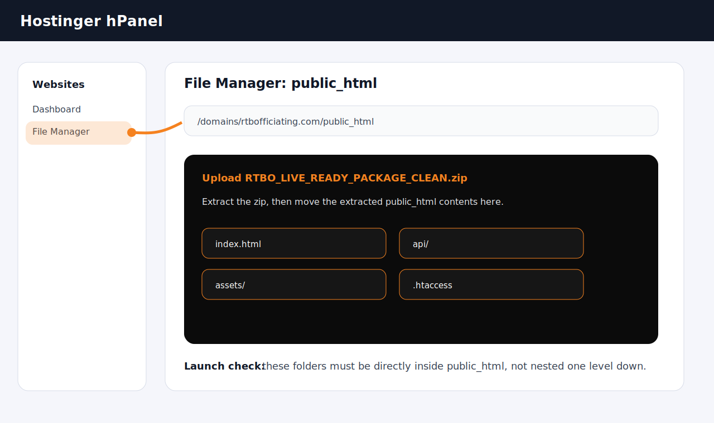
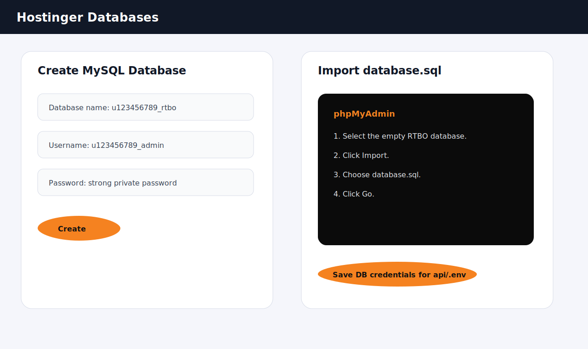
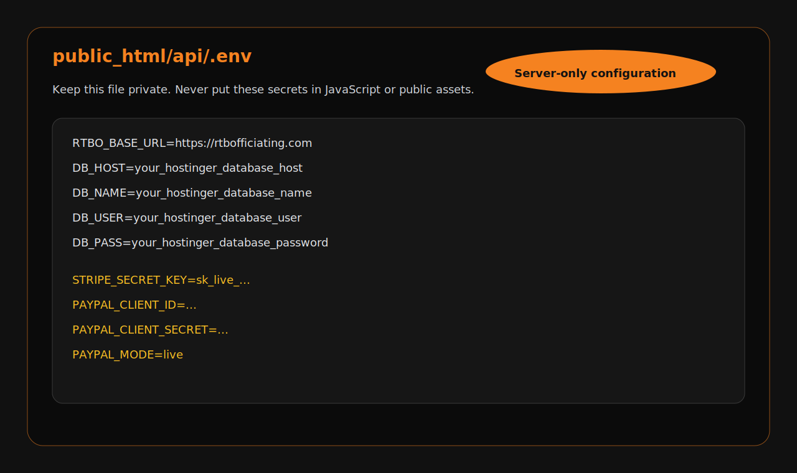
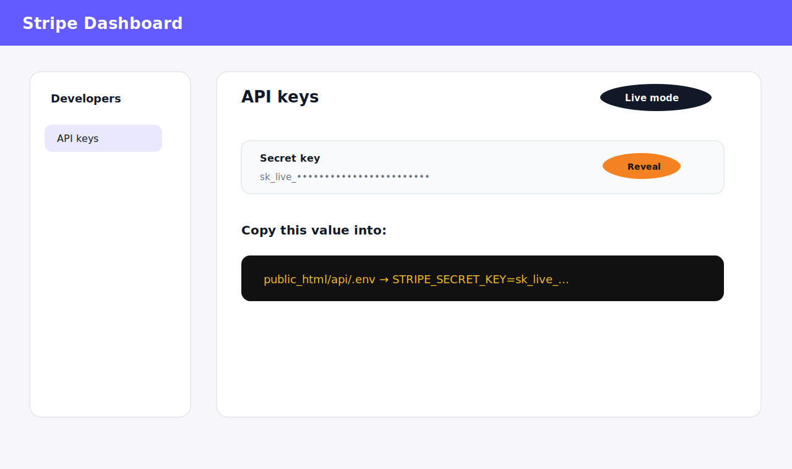
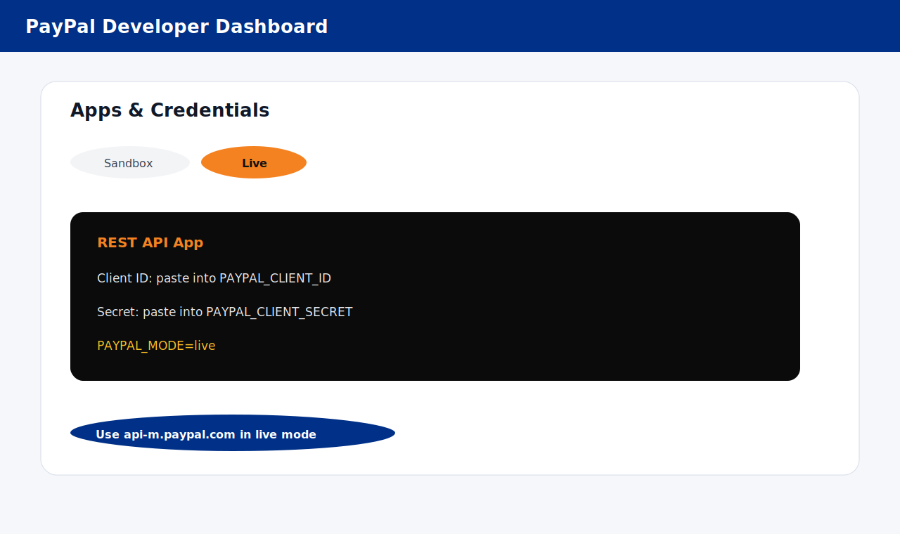
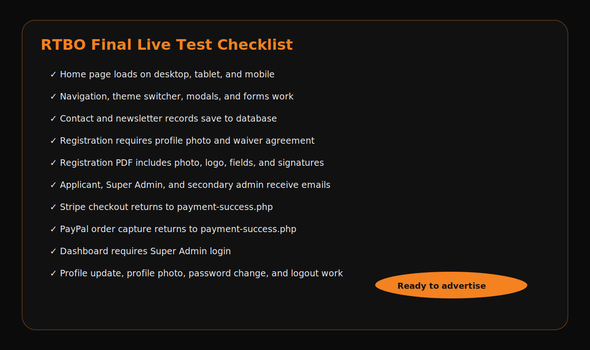

# RTBO Production Deployment Guide

This guide deploys the current RTBO React + PHP full-stack site to Hostinger, creates the Super Admin login, and connects live Stripe and PayPal payments.

## Production Readiness Status

Latest local gates completed before packaging:

- PHP syntax lint: passed.
- React production build: passed.
- Frontend dependency audit: passed with 0 production vulnerabilities.
- Enterprise production gate: passed.
- Static production scan: no hardcoded staging password, Stripe secret, PayPal secret, debug logging, `alert()`, `eval()`, or public `innerHTML` injection found in live RTBO paths.

The live upload package is:

```text
RTBO_LIVE_READY_PACKAGE_CLEAN.zip
```

The zip contains a `public_html` folder, `database.sql`, this guide, and deployment screenshots.

## Screenshot 1 - Hostinger File Manager



1. Sign in to Hostinger.
2. Go to `Websites`.
3. Click `Dashboard` or `Manage` beside `rtbofficiating.com`.
4. Open `File Manager`.
5. Open the domain `public_html` folder.
6. Upload `RTBO_LIVE_READY_PACKAGE_CLEAN.zip`.
7. Extract the zip.
8. Open the extracted folder and move everything inside its `public_html` folder into the live `public_html` folder.
9. Confirm these files and folders are directly inside live `public_html`:

```text
index.html
.htaccess
assets/
api/
payment-success.php
payment-cancel.php
robots.txt
sitemap.xml
```

Source: Hostinger File Manager documentation says File Manager is accessed from hPanel Websites, then Dashboard, and website files should be managed inside the domain file area.

## Screenshot 2 - Create and Import MySQL Database



1. In Hostinger, go to `Websites` → `Manage`.
2. Open `Databases` → `Management`.
3. Create a MySQL database and database user.
4. Copy the database name, username, password, and host.
5. Click `Enter phpMyAdmin`.
6. Select the new empty database.
7. Click `Import`.
8. Choose the included `database.sql`.
9. Click `Go`.

Source: Hostinger documents creating databases from Websites → Manage → Databases Management, and importing SQL through phpMyAdmin with the Import tab.

## Screenshot 3 - Configure api/.env



1. In Hostinger File Manager, open `public_html/api`.
2. Copy `.env.example`.
3. Rename the copy to `.env`.
4. Edit `.env` with your live values:

```text
RTBO_ADMIN_EMAIL=admin@rtboofficiating.com
RTBO_OWNER_EMAIL=montrel.simmons@rtboofficiating.com
RTBO_FROM_EMAIL=admin@rtboofficiating.com
RTBO_BASE_URL=https://rtbofficiating.com
RTBO_SUPER_ADMIN_EMAIL=mrbballref1775@yahoo.com
RTBO_REGISTRATION_ADMIN_EMAIL=admin@rtboofficiating.com
RTBO_REGISTRATION_SECONDARY_EMAIL=mrbballref1775@yahoo.com
RTBO_CONTACT_EMAIL=mrbballref1775@yahoo.com
RTBO_SETUP_ENABLED=false
RTBO_SETUP_TOKEN=replace_with_a_long_random_one_time_setup_token
RTBO_SMTP_HOST=your_smtp_host
RTBO_SMTP_PORT=587
RTBO_SMTP_USERNAME=your_smtp_username
RTBO_SMTP_PASSWORD=your_smtp_password
RTBO_SMTP_ENCRYPTION=tls
RTBO_SMTP_TIMEOUT=15
RTBOMAIL_BATCH_SIZE=80
RTBOMAIL_MAX_ATTACHMENT_BYTES=15728640

DB_HOST=your_hostinger_database_host
DB_NAME=your_hostinger_database_name
DB_USER=your_hostinger_database_user
DB_PASS=your_hostinger_database_password

STRIPE_SECRET_KEY=
PAYPAL_CLIENT_ID=
PAYPAL_CLIENT_SECRET=
PAYPAL_MODE=live

GOT_U_NEX_REF_API_URL=
GOT_U_NEX_REF_SYNC_TOKEN=
```

Contact and registration notification emails use the current Super Admin profile email first. The email values above are fallbacks for setup, mail sending, or a missing profile record.

Configure SMTP for production email delivery. Invoice emailing, RTBOMAIL distribution emails, registration confirmations, password resets, contact notifications, and newsletters use these SMTP settings when `RTBO_SMTP_HOST` is present. If SMTP is missing, the API falls back to PHP `mail()` and returns an explicit delivery error if the server is not configured to send mail.

Do not add secrets to React, JavaScript, CSS, `index.html`, or any public file.

## Create Your Super Admin Login

1. Temporarily edit `public_html/api/.env`:

```text
RTBO_SETUP_ENABLED=true
RTBO_SETUP_TOKEN=make_this_a_long_random_private_token
```

2. Use Postman, Thunder Client in VS Code, or another HTTP client to send this request:

```http
POST https://rtbofficiating.com/api/setup-super-admin.php
Content-Type: application/json
```

```json
{
  "setup_token": "make_this_a_long_random_private_token",
  "email": "admin@rtboofficiating.com",
  "first_name": "Montrel",
  "last_name": "Simmons",
  "password": "Use-A-Strong-Private-Password-Here"
}
```

3. Confirm the response says the Super Admin account is ready.
4. Immediately set this back in `api/.env`:

```text
RTBO_SETUP_ENABLED=false
```

5. Go to `https://rtbofficiating.com`, click `Sign In`, and log in.

## Screenshot 4 - Stripe Live Setup



The RTBO site uses Stripe Checkout Sessions. Stripe recommends Checkout Sessions for most payment flows because Stripe hosts the payment page and handles checkout state.

1. Sign in to Stripe Dashboard.
2. Complete Stripe account activation.
3. Go to `Developers` → `API keys`.
4. Turn off `Test mode` so you are viewing live keys.
5. Reveal and copy the live secret key that starts with `sk_live_`.
6. In Hostinger File Manager, open `public_html/api/.env`.
7. Set:

```text
STRIPE_SECRET_KEY=sk_live_your_real_live_secret_key
STRIPE_PUBLISHABLE_KEY=pk_live_your_real_live_publishable_key
STRIPE_ONE_TIME_PAYMENT_AMOUNT_CENTS=5000
STRIPE_BOOKING_DEPOSIT_AMOUNT_CENTS=5000
STRIPE_BOOKING_PAYMENT_AMOUNT_CENTS=25000
STRIPE_MEMBERSHIP_PRICE_ID=price_your_membership_recurring_price_id
STRIPE_SUBSCRIPTION_PRICE_ID=price_your_subscription_recurring_price_id
```

8. In Stripe Dashboard, create recurring Prices for memberships and subscriptions, then paste those `price_...` IDs into `STRIPE_MEMBERSHIP_PRICE_ID` and `STRIPE_SUBSCRIPTION_PRICE_ID`.
9. Go to `Developers` → `Webhooks`, add endpoint `https://rtboofficiating.com/api/stripe-webhook.php`, and listen for `checkout.session.completed`, `checkout.session.async_payment_failed`, `invoice.paid`, `invoice.payment_failed`, `customer.subscription.updated`, and `customer.subscription.deleted`.
10. Copy the webhook signing secret that starts with `whsec_` and add it:

```text
STRIPE_WEBHOOK_SECRET=whsec_your_webhook_signing_secret
```

11. Save the file.

Important: RTBO currently creates Checkout Sessions server-side and redirects applicants to Stripe. Do not place Stripe secret keys in public frontend code.

## Screenshot 5 - PayPal Live Setup



The RTBO site uses PayPal Orders v2: it creates an order, sends the applicant to PayPal approval, then captures the order on the success return.

1. Sign in to PayPal Developer Dashboard.
2. Open `Apps & Credentials`.
3. Switch from `Sandbox` to `Live`.
4. Create a REST API app.
5. Copy the live Client ID and Secret.
6. In Hostinger File Manager, open `public_html/api/.env`.
7. Set:

```text
PAYPAL_CLIENT_ID=your_live_paypal_client_id
PAYPAL_CLIENT_SECRET=your_live_paypal_client_secret
PAYPAL_MODE=live
```

8. Save the file.

Source: PayPal says moving to production requires obtaining live credentials, including them in the integration, and using the live API endpoint.

## Screenshot 6 - Final Live Test Checklist



Run these tests in this order:

1. Open `https://rtbofficiating.com` on desktop, tablet, and mobile.
2. Confirm every navigation link opens the correct section/page.
3. Toggle light/dark mode and refresh the page.
4. Submit the contact form and confirm the message appears in the dashboard.
5. Submit the newsletter form and confirm the subscriber appears in the dashboard.
6. Submit a school registration with a real profile photo.
7. Confirm the application PDF is created.
8. Confirm the application PDF is emailed to the applicant, `admin@rtboofficiating.com`, and `mrbballref1775@yahoo.com`.
9. Complete one Stripe test or low-dollar live payment.
10. Confirm `payment-success.php` shows the payment confirmed screen.
11. Confirm the registration payment status changes to `paid` in the dashboard.
12. Repeat with PayPal.
13. Log in as Super Admin.
14. Update your profile picture, phone number, address, conferences, and password.
15. Confirm logout ends the dashboard session.

## Rollback Plan

Before replacing the live site, download or rename the current `public_html` folder. If the new upload has a problem, restore the previous folder immediately, then review the Hostinger error logs.

## Official References

- Hostinger File Manager: https://www.hostinger.com/support/4548688-basic-actions-in-the-file-manager-in-hostinger/
- Hostinger MySQL database creation: https://www.hostinger.com/support/1583542-how-to-create-a-new-mysql-database-in-hostinger/
- Hostinger phpMyAdmin import: https://www.hostinger.com/support/1884149-how-to-import-a-database-with-phpmyadmin-in-hostinger/
- Stripe API keys: https://docs.stripe.com/keys
- Stripe Checkout Sessions: https://docs.stripe.com/payments/checkout-sessions
- Stripe go-live checklist: https://docs.stripe.com/get-started/checklist/go-live
- PayPal production setup: https://developer.paypal.com/reference/production/
- PayPal REST APIs: https://developer.paypal.com/api/rest/
